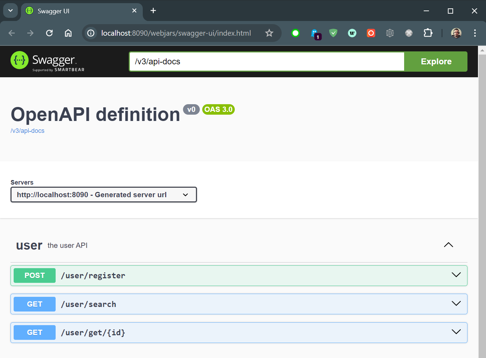
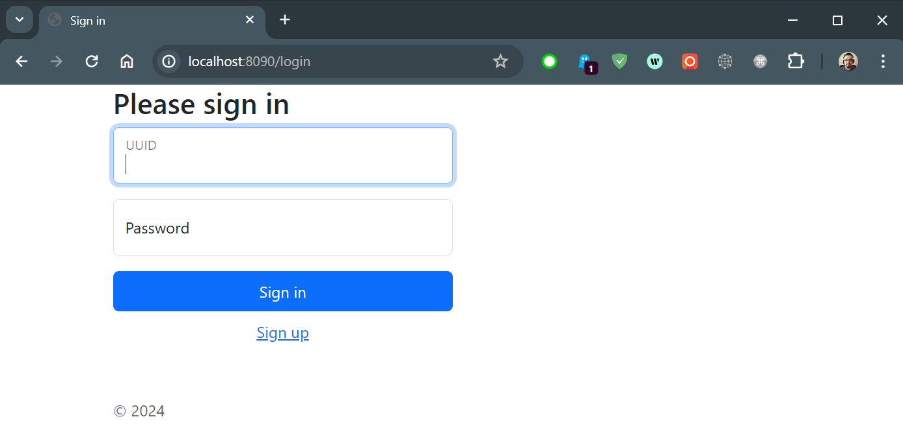
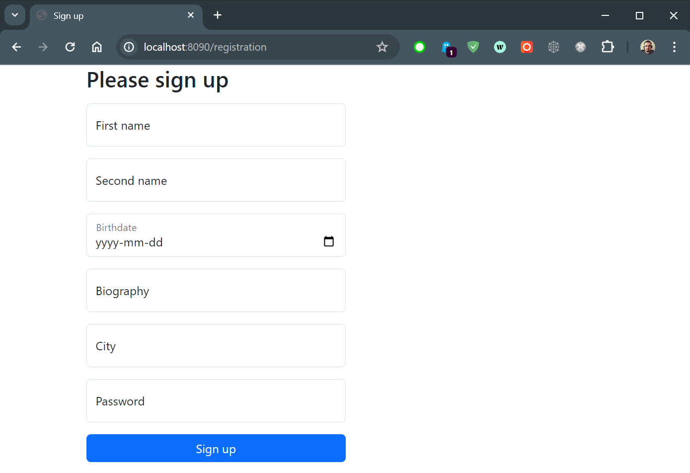
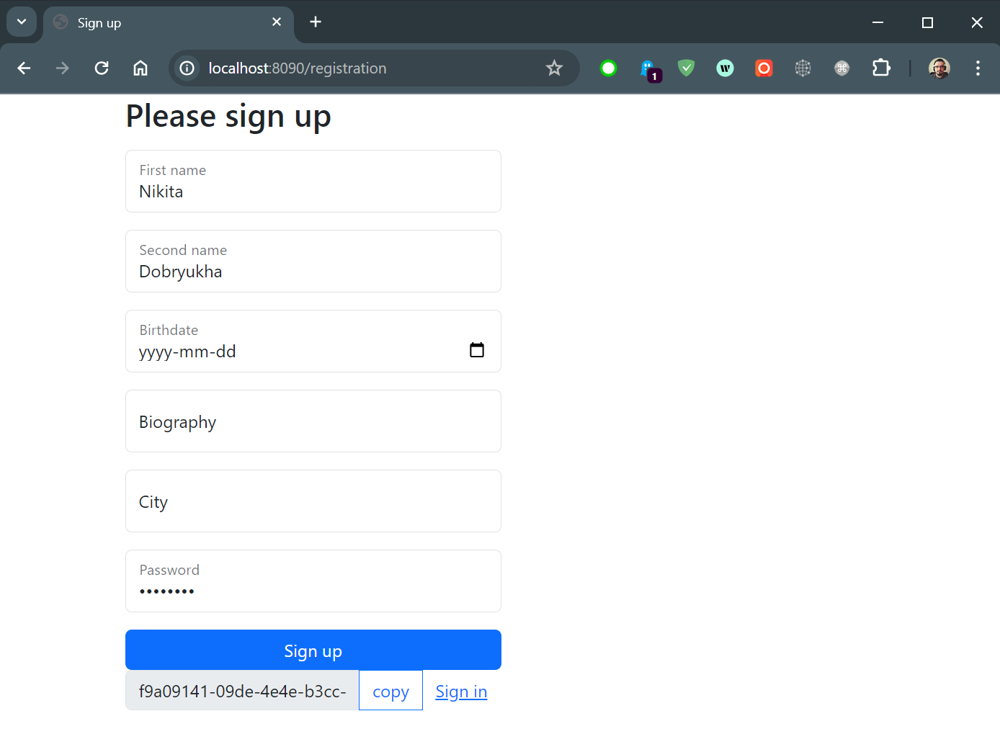
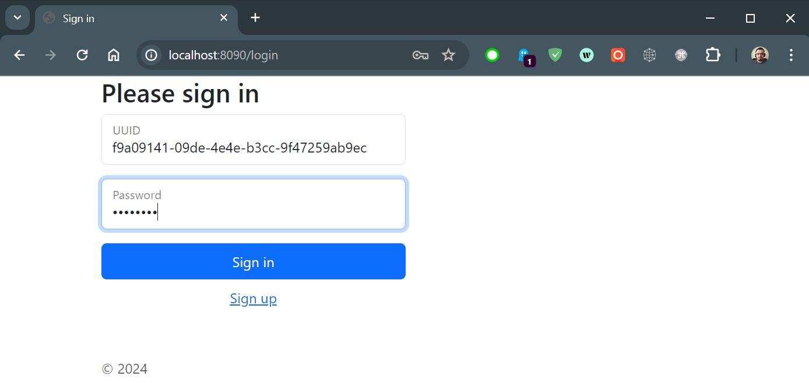
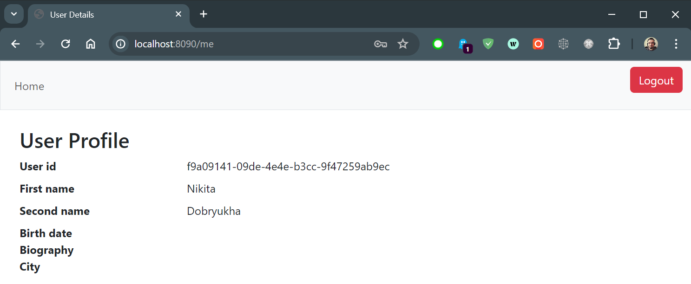
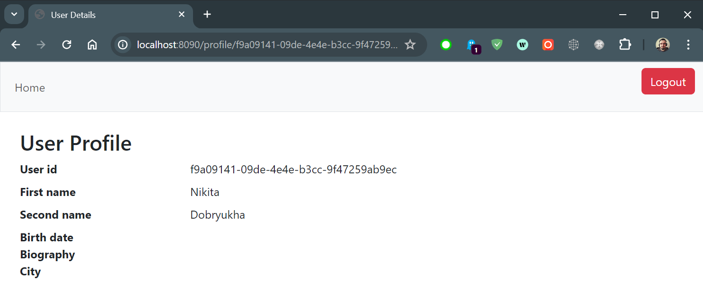
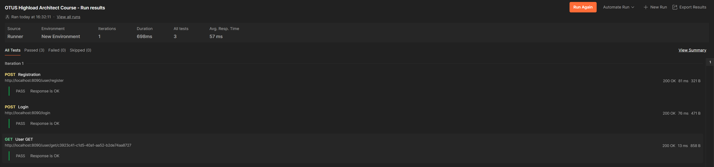

## 01. It's a dummy social network

### Functional requirements:
* Simplest authorization
* Possibility to register a user with the following information
    * First name
    * Second name
    * Birthdate
    * Biography
    * City
* Profile page

### Non-functional requirements:
* Any programming language
* Postgre SQL as a database (or any other if you want)
* Don't use an ORM
* Application is a monolith
* Don't recommend to use the following technologies:
  * Replication
  * Sharding
  * Indexes
  * Caching

#### For the convenient you may use that [specification](https://github.com/OtusTeam/highload/blob/master/homework/openapi.json) and implement the following mwthods:
* `/login`
* `/user/register`
* `/user/get/{id}`

The front-end is optional.

To make a manual for the local running.

## Local running

Make sure you have `git` and `docker` on your local machine.

1. Clone the project `git clone https://github.com/n-dobryukha/Otus-Highload-Architect-Course.git`
2. Build an image `docker build -t highload-architect-demo --no-cache .`
3. Run docker compose `docker compose up -d`

The app is running on http://localhost:8090

## Usage of the app

### 1. Swagger UI

Open the root page http://localhost:8090 which redirects you to the http://localhost:8090/webjars/swagger-ui/index.html

### 2. Web UI

Open the login page http://localhost:8090/login

In case it's your first visit click to [Sign up](http://localhost:8090/registration) link which redirects you to the registration form

Fill in the information you are ready to share and click the `Sing up` button.

In the case of successful registration you'll see the UUID you've been assigned with.

Click the `Copy` button and then go the link [Sign in](http://localhost:8090/login)

Fill in the login form and click the `Sign in` button.

In case of the successful login you'll be redirected to the your own [profile](http://localhost:8090/me) page.

If you want to visit any other user profile go to the link http://localhost:8090/profile/{uuid}

To log out click the red button `Logout`.

## 3. Postman

Import the postman [collection](../../../postman/OTUS%20Highload%20Architect%20Course.postman_collection.json) and run that.
