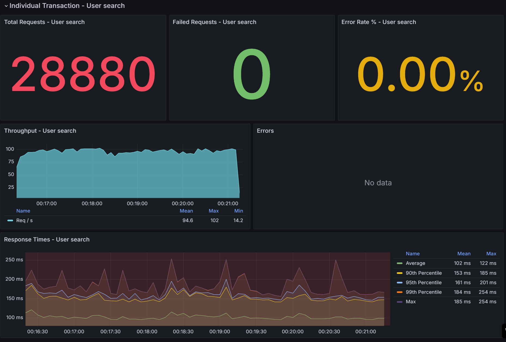
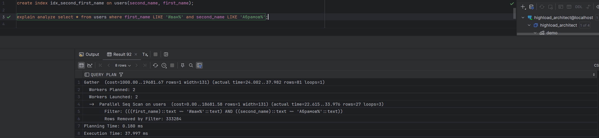

## 02. Indexes performance

### Stages
1.  Generate in any way 1,000,000 profiles. The first and last names must be real in order to be considered for index selectivity. You may use the generated [list](https://raw.githubusercontent.com/OtusTeam/highload/master/homework/people.v2.csv) as a base.
2. Implement the functionality of searching profiles by prefix of first and last name (simultaneously) in your social network (implement the method `/user/search` from the [specification](https://github.com/OtusTeam/highload/blob/master/homework/openapi.json) (the query is in the form `firstName LIKE ? and secondName LIKE ?`)). Sort the response by a profile id.
3. Do a load testing of this method. Use a various count of simultaneous requests 1/10/100/1000.
4. Build the graphs and save them into a report.
5. Create a suitable index.
6. Repeat the points 3 and 4.
7. As a result provide a report must consist of:
   * Latency graphs before index
   * Throughput graph before index
   * Latency graphs after index
   * Throughput graph after index
   * Query for index creation
   * Explain of a query after index

### Report

#### Before index
1. 10 threads
   
   
2. 100 threads
   
   
3. 1000 threads
   
   

### Index selection
1. Non index
   
2. Separate index
   
3. Composite index by first and second name
   
4. Composite index by second and first name
   
5. Composite index by first and second name (improved)
   
6. Composite index by second and first name (improved)
   

   The improved composite index by second and first name has been chosen as a result index.

### After index
1. 10 threads
   
   
2. 100 threads
   
   
3. 1000 threads
   
   