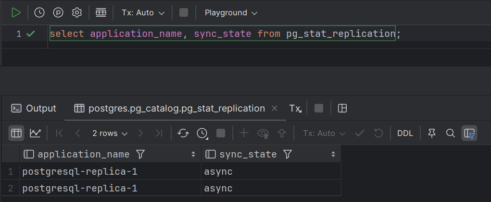
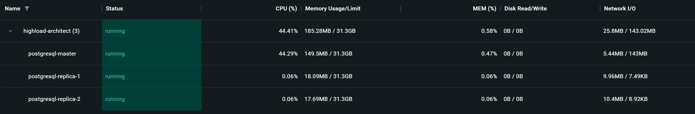
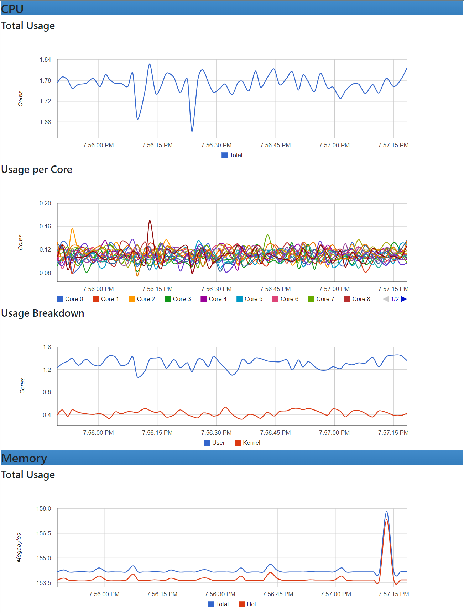
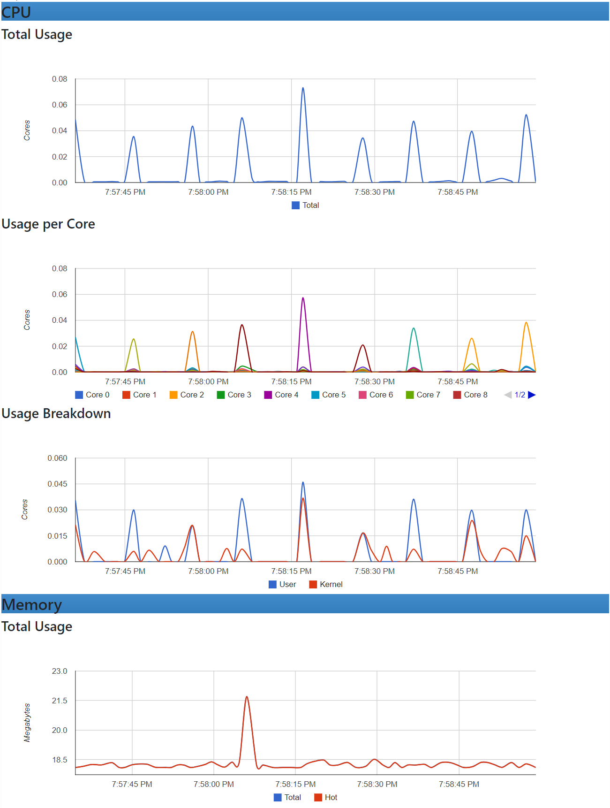
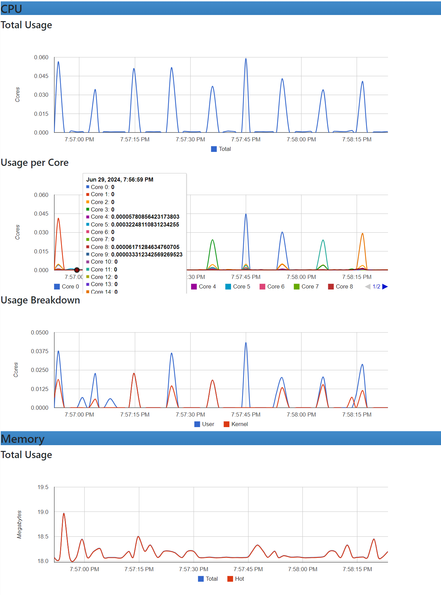
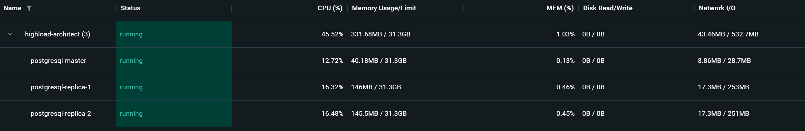
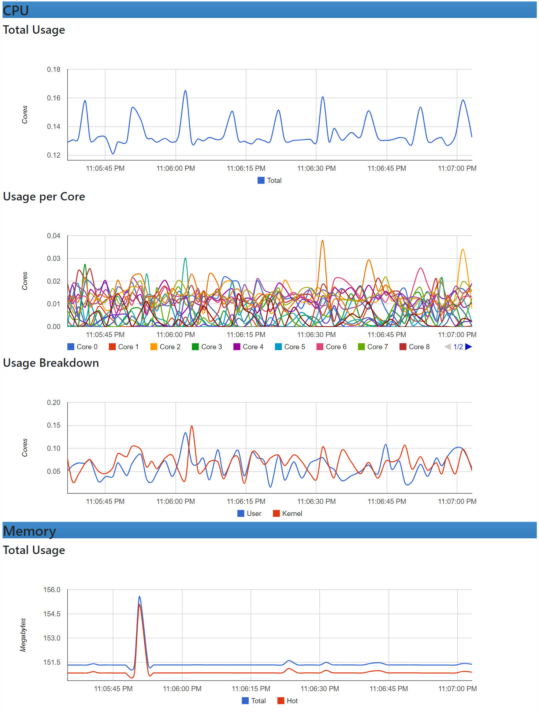
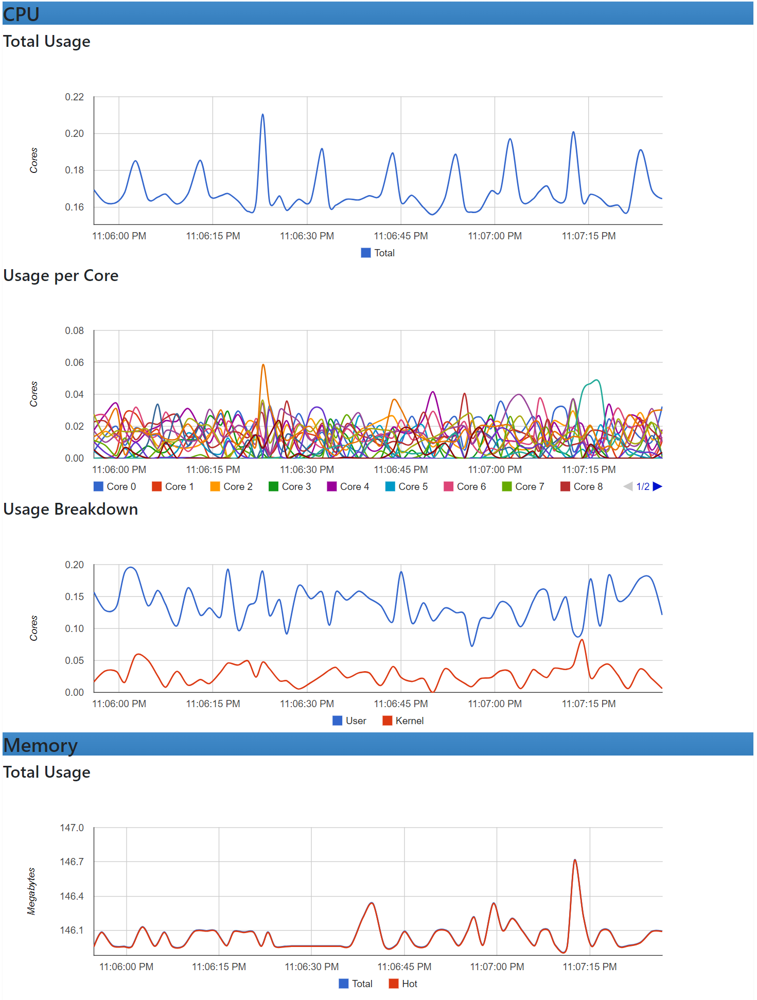
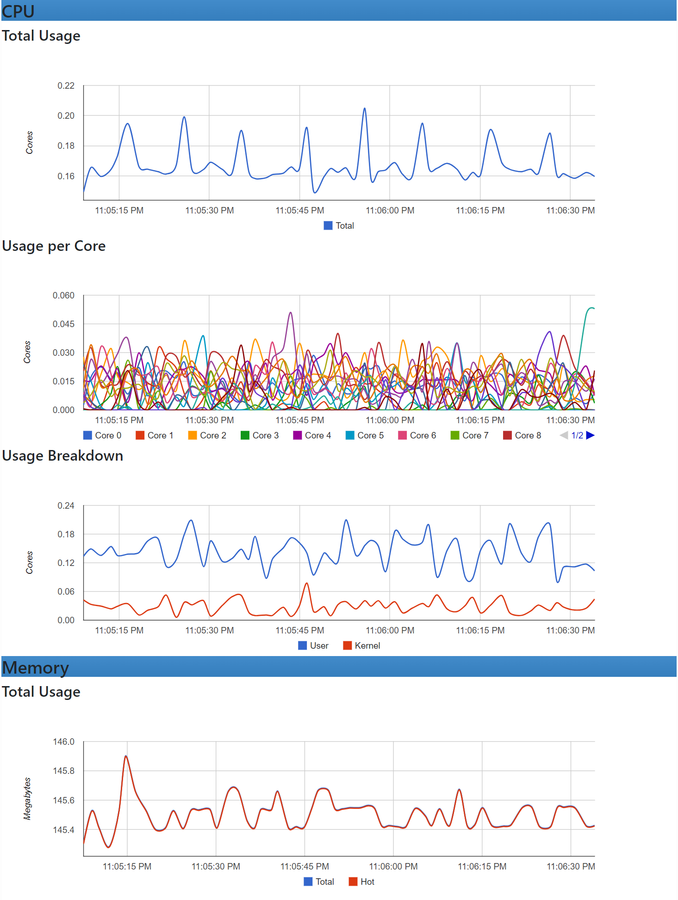

## 03. Replication: in action

### Stages
1. Set up async replication.
2. Move 2 reading requests (`/user/get/{id}` and `/user/search` from the [specification](https://github.com/OtusTeam/highload/blob/master/homework/openapi.json)) on slave.
3. Do a load testing before and after a replication. Measure a load of a master (CPU, la, disc usage, memory usage).
4. Set up 2 slaves and 1 master.
5. Enable streaming replication.
6. (Optional) Use one of cluster extension for the Postgres (for example `patroni`).
7. Set up quorum sync replication.
8. Create a load for writing to any test table. On the side that we load to count how many lines we have successfully recorded.
9. Kill one of the replicas (kill -9, docker stop).
10. End a load for writing.
11. Choose the most recent slave. Let's promote it to the master. Switch the second slave to it.
12. Check if there are any transaction losses.

### Report

Set up async replication

### Reading `/user/search` from master
1. Aggregate graph
   
2. Master
   
3. Replica-1
   
4. Replica-2
   

Only master is loaded.

### Reading `/user/search` from replicas
1. Aggregate graph
   
2. Master
   
3. Replica-1
   
4. Replica-2
   

The load is evenly distributed on replicas.